# Cushion - A library to help state transition matrix design

[](#)
[](https://travis-ci.com/shoo/cushion)
[](https://codecov.io/gh/shoo/gendoc)

This library aims to process the table which is state transition matrix designed on the D language source code.
Tables written in csv file will be converted to D language source code at compile time.

# Instlation and Build

Cushion is a github project, hosted at https://github.com/shoo/cushion
To get and build it:

```sh
git clone https://github.com/shoo/cushion.git
cd cushion
dub build
```

This library is registered in dub, you can use it by adding it to your dub project as follows.

In json:

```json
{
	"//" : " ...",
	"dependencies": {
		"cushion": "~><current-version>"
	},
	"//" : " ..."
}
```

In sdl:

```sdl
...
dependencies "cushion" version="~><current-version>"
...
```

In addition, you can generate documentation about the API by adding some dub options:

```sh
dub :doc -c=adrdox
dub :doc -c=hmod
dub :doc -c=ddox
dub run gendoc
```

Each generated results are stored in the `doc/<toolname>` directory.

# What is the State Transition Matrix
This case explains how to operate the music player with the start button and the stop button by STM.

The players play music when the [start] button is pushed while Stop state. And when you push the [start] button during Playing, the behavior will change and music playback will Pause state. When the [stop] button is pushed, the player stops music playback and returns to the initial state(Stop).

If this is a state transition diagram, it will be as follows:



Oops, this diagram is wroned. In Pause state, it is not considered to push the stop button.
In addition, it is not considered about the stop button is pushed while stop state too. This means to "undefined behavior" that everyone dislikes...  
In a state transition diagram, extremely careful consideration is required to remove these consideration omissions.

If we think in 2 events and 3 states like this time, 6 patterns are enough. This will still be manageable.  
But the reality is not sweet. If you have to think of 20 events and 15 states, there are 300 patterns to consider. You have to find the perfect right behavior for these. That's impossible.

These omissions can be reduced by putting them in a table.  
The matrix that expresses state transitions based on rules is called a STM(State Transition Matrix).

When this specification is made to STM, the following table can be created.

| *MusicPlayer* |#>stop                   | #>play                  | #>pause                 |
|:--------------|:------------------------|:------------------------|:------------------------|
| onStart       | #>play<br>- Start music | #>pause<br>- Stop music | #>play<br>- Start music |
| onStop        |                         | #>stop<br>- Stop music<br>- Return to first | #>stop<br>- Return to first |

Each column has a state, and each row has an event. When an event occurs in a certain state, it is a table that represents which state to transition to.  
It is also possible to describe the behavior at the time of transition.

This library is for automatically converting STM into source code of D (at Compile Time!).

# Usage
Cushion is mainly consist of template struct `StateTransitor`.
StateTransitor is instantiated by Event and State enumeration given from outside the template struct. Set this up by registering a callback handler and the following state for each Event and State.

```d
import cushion;
enum State { stop, play, pause }
enum Event { onStart, onStop }
auto stm = StateTransitor!(State, Event);
stm.setHandler(State.stop, Event.onStart, (){ writeln("play!"); });
stm.setHandler(State.play, Event.onStop,  (){ writeln("stop!"); });
// :
// :
stm.setNextState(State.stop,  Event.onStart, State.play);
stm.setNextState(State.play,  Event.onStart, State.pause);
// :
// :
```

This setup can be replaced by the CSV of STM described in the next section.

After instance setup is complete, put events to make a state transition.

```d
assert(stm.currentState == State.stop);
stm.put(Event.onStart); // "play!"
assert(stm.currentState == State.play);
stm.put(Event.onStop); // "stop!"
assert(stm.currentState == State.stop);
```

# How to design by CSV for STM
The above setup process is very tedious, cumbersome and annoying. Let's automate such troubles.
Cushion has a feature to automatically convert STM written in CSV into D language code.

Here, the following two files are prepared as STM of the above-mentioned music player.

- [MusicPlayer.stm.csv](examples/stmtest/views/MusicPlayer.stm.csv)
- [MusicPlayer.map.csv](examples/stmtest/views/MusicPlayer.map.csv)

The first `MusicPlayer.stm.csv` is a CSV representing STM.
In each cell of the table, the transition destination and processing are described in natural language.
Representations in natural language are replaced by table of second file `MusicPlayer.map.csv` and converted into a program expression in D.
One line in each cell is subject to replacement. However, those that do not exist in the replacement map are not replaced.

To execute the pair of STM and replacement map as code, see the following code:

```d
import cushion;

// Programs to be driven by STM
string status = "stopped";
StopWatch playTime;
void startMusic() { playTime.start(); status = "playing"; }
void stopMusic()  { playTime.stop();  status = "stopped"; }
void resetMusic() { playTime.reset(); }
void delay(uint tim) @trusted
{
	import core.thread: Thread, msecs;
	Thread.sleep(tim.msecs);
}

// Create StateTransitor instance
mixin(loadStmFromCsv!"MusicPlayer"("#>"));
auto stm = makeStm();

// Initial state is "stop" that most left state.
assert(stm.currentState == stm.State.stop);
assert(stm.getStateName(stm.currentState) == "#>stop");
assert(stm.getEventName(stm.Event.onStart) == "onStart");
assert(status == "stopped");

// onStart event / transit to the "#>play" state
stm.put(stm.Event.onStart);
assert(stm.currentState == stm.State.play);
assert(playTime.running);
delay(10); // progress in playing...
assert(playTime.peek != 0.msecs);
assert(status == "playing");

// onStart event / transit to the "#>pause" state
stm.put(stm.Event.onStart);
assert(stm.currentState == stm.State.pause);
assert(!playTime.running);
assert(status == "stopped");

// onStop event / transit to the "#>stop" state
stm.put(stm.Event.onStop);
assert(stm.currentState == stm.State.stop);
assert(!playTime.running);
delay(10); // progress in stopped...
assert(playTime.peek == 0.msecs);
```


# Examples
You can find information on how to use cushion in examples of following:
https://github.com/shoo/cushion/tree/master/examples

Those examples can be compiled like following:

```
git clone https://github.com/shoo/cushion.git
cd cushion
dub build :stmtest
```

Enjoy!

# License
Cushion is licensed by [Boost Software License 1.0](LICENSE)

